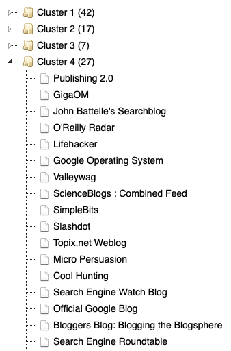
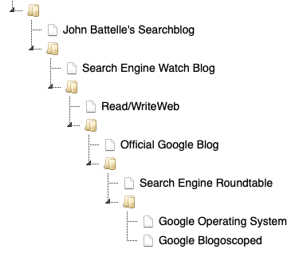

# A2 - Clustering

## Description

* In this assignment, you shall implement clustering on the blogs dataset containing 99 blogs.
* You can use any programming language you like.
* ~~You can work alone or in a group of two students.~~
* You shall present your application and code at an oral examination.

## Submission instructions

See the [Deadlines and Submissions](https://coursepress.lnu.se/courses/web-intelligence/study-guide/deadlines-and-submissions) page.

## Requirements

<table>
  <tr>
    <th>Grade</th>
    <th>Requirements</th>
  </tr>
  <tr>
    <td>E</td>
    <td>
      <ul>
        <li>Implement K-means Clustering with Pearson similarity.</li>
        <li>Run the algorithm on the <em>blog data</em> dataset (see <a href="https://coursepress.lnu.se/courses/web-intelligence/assignments/datasets">Datasets</a> page) with five clusters.</li>
        <li>The iteration shall stop after a specified number of iterations.</li>
        <li>Present the result as a list of clusters and their assignments.</li>
        <li>Implement the system using a REST web service where:
          <ol>
            <li>client sends a request to a server.</li>
            <li>the server responds with <em>json</em> data.</li>
            <li>the <em>json</em> data is decoded and presented in a client GUI.</li>
          </ol>
        </li>
      </ul>
    </td>
  </tr>
  <tr>
    <td>C-D</td>
    <td>
      <ul>
        <li>Instead of stopping after a specified number of iterations, you shall implement functionality for stopping when no new assignments are made.</li>
        <li>Each cluster must keep track of the previous assignment, and a check is made if the new cluster assignment matches the previous one.</li>
      </ul>
    </td>
  </tr>
  <tr>
    <td>A-B</td>
    <td>
      <ul>
        <li>Implement Hierarchical Clustering with Pearson similarity.</li>
        <li>Run the algorithm on the <em>blog data</em> dataset.</li>
        <li>Present the result as an interactive tree in the client GUI (it shall be possible to expand/collapse branches).</li>
      </ul>
    </td>
  </tr>
</table>

## Test cases

### K-means

K-means is not deterministic (the results differ between runs), but you usually find related blogs such as the Google and search engine blogs in one cluster as shown here:

>Note that you can make some performance improvements to speed up the cluster generation. In comparison, my implementation in Python takes around 3 seconds to generate the clusters and build a JSON response.

### Hierarchical

Hierarchical clustering always gives the same result. The tree is too large to show here, but if you get the branch shown below, it most likely works correctly:

>Note that there are many performance improvements you can make to speed up tree generation. As a comparison, my implementation in Python takes around 10 seconds to generate the tree and build a JSON response.
